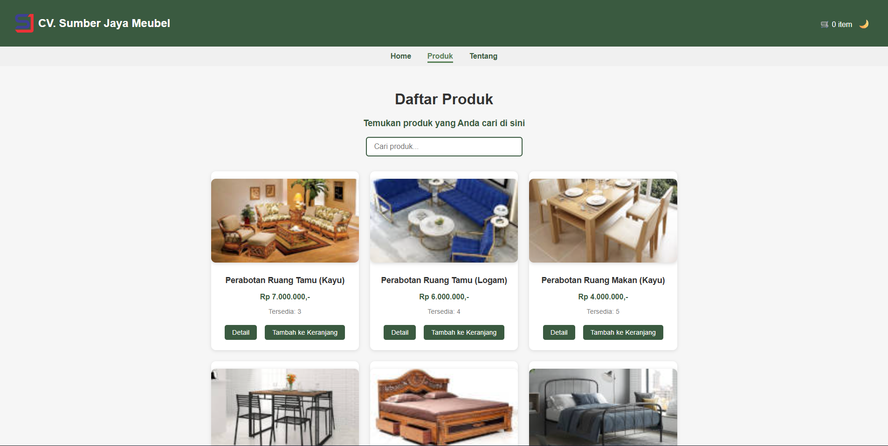
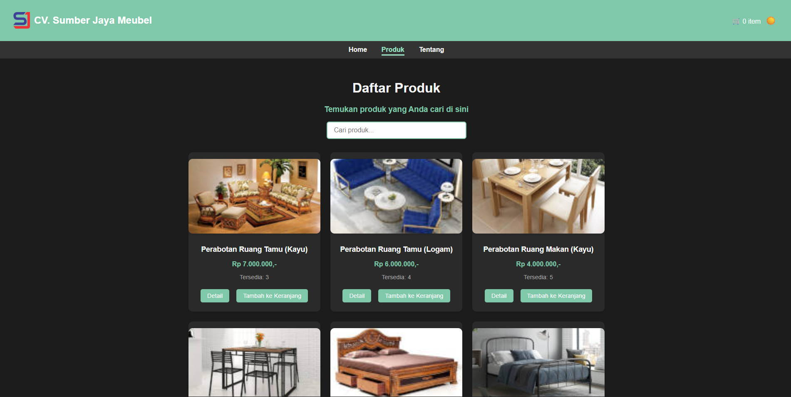

# 🌿 Toko Meubel Web - Frontend Project

Proyek ini adalah website sederhana bertema *Toko Meubel* yang dibuat menggunakan **HTML, CSS, dan JavaScript**.  
Website ini mendukung **tema gelap (dark mode)** dan **tema terang (light mode)** dengan desain yang responsif.

---

## 🚀 Fitur Utama

- 🌗 **Dark/Light Mode Toggle** (otomatis menyimpan preferensi pengguna)
- 🪴 **Halaman Produk** dengan grid responsif
- 🔍 **Fitur Pencarian Produk**
- 🧾 **Halaman Detail Produk** dengan tabel informasi
- 📱 **Tampilan Responsif** di perangkat mobile
- 🎨 **Palet warna alami** bertema hijau lembut dan modern

---

## 🧩 Struktur Folder

```
📦 proyek-toko-Meubel
├── index.html
├── produk.html
├── detail.html
├── tentang.html
├── style.css
├── script.js
└── assets/
    ├── logo.png
    └── images/
```

---

## 💻 Cara Menjalankan

1. Download atau clone repositori ini.
   ```bash
   git clone https://github.com/IlhamNur/toko-meubel.git
   ```

2. Buka file `index.html` di browser favorit Anda.

3. Ubah tema dengan klik ikon 🌞/🌙 di pojok kanan atas.

---

## 🧱 Teknologi yang Digunakan

- **HTML5**
- **CSS3 (Custom Properties, Grid, Flexbox)**
- **JavaScript (DOM Manipulation, LocalStorage)**

---

## 📸 Preview

### 🟢 Mode Terang


### ⚫ Mode Gelap


---

## 👨‍💻 Pengembang

**Nama:** Ilham Nur  
**Tahun:** 2022

---
